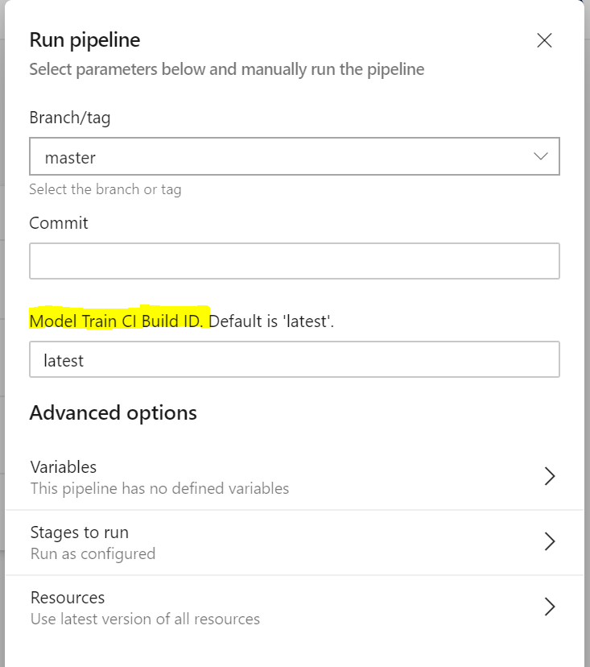

# CI/CD pipelines for model train/register and deployment

Follow this guide to set up two separate pipelines to train/register models and deploy models. This set of pipelines is functionally similar to the [diabetes_regression-ci.yml](../.pipelines/diabetes_regression-ci.yml) pipeline in the [getting started](getting_started.md) guide.

1. **Model CI, training, evaluation, and registration** - triggered on code changes to master branch on GitHub. Runs linting, unit tests, code coverage, and publishes and runs the training pipeline. If a new model is registered after evaluation, it creates a build artifact containing the JSON metadata of the model. Definition: [diabetes_regression-train-register.yml](../.pipelines/diabetes_regression-train-register.yml).
1. **Release deployment** - consumes the artifact of the previous pipeline and deploys a model to either [Azure Container Instances (ACI)](https://azure.microsoft.com/en-us/services/container-instances/), [Azure Kubernetes Service (AKS)](https://azure.microsoft.com/en-us/services/kubernetes-service), or [Azure App Service](https://docs.microsoft.com/en-us/azure/machine-learning/service/how-to-deploy-app-service) environments. Definition: [diabetes_regression-deploy.yml](../.pipelines/diabetes_regression-deploy.yml).

## Prerequisites

---

It is recommended to go through the [getting started guide](getting_started.md) before starting this guide.

---

Before continuing this guide, you will need:

- An existing workspace. To setup your environment with a new workspace, follow the steps here.
- An Azure DevOps Service Connection with your Azure ML Workspace.
- A variable group named **``devopsforai-aml-vg``** with the required variables set.

## Model CI, training, evaluation, and registration pipeline

In this section, we will create the pipeline that will perform model IC, training, evaluation, and registration.

### Set up the Pipeline

In your Azure DevOps project, create and run a new build pipeline based on the  [diabetes_regression-ci-train-register.yml](../.pipelines/diabetes_regression-ci-train-register.yml)
pipeline definition in your forked repository.

If you plan to use the release deployment pipeline (in the next section), you will need to rename this pipeline to `Model-Train-Register-CI`.

Once the pipeline is finished, check the execution result:

And the pipeline artifacts:

The pipeline stages are summarized below:

#### Model CI

- Linting (code quality analysis)
- Unit tests and code coverage analysis
- Build and publish *ML Training Pipeline* in an *ML Workspace*

#### Train model

- Determine the ID of the *ML Training Pipeline* published in the previous stage.
- Trigger the *ML Training Pipeline* and waits for it to complete.
  - This is an **agentless** job. The CI pipeline can wait for ML pipeline completion for hours or even days without using agent resources.
- Determine if a new model was registered by the *ML Training Pipeline*.
  - If the model evaluation determines that the new model doesn't perform any better than the previous one, the new model won't register and the *ML Training Pipeline* will be **canceled**. In this case, you'll see a message in the 'Train Model' job under the 'Determine if evaluation succeeded and new model is registered' step saying '**Model was not registered for this run.**'
  - See [evaluate_model.py](../diabetes_regression/evaluate/evaluate_model.py#L118) for the evaluation logic.
  - [Additional Variables and Configuration](getting_started.md#additional-variables-and-configuration) for configuring this and other behavior.

#### Create pipeline artifact

- Get the info about the registered model
- Create a pipeline artifact called `model` that contains a `model.json` file containing the model information.

## Release deployment pipeline

---
**PREREQUISITE**

In order to use this pipeline:

1. Follow the steps to set up the Model CI, training, evaluation, and registration pipeline.
1. You **must** rename your model CI/train/eval/register pipeline to `Model-Train-Register-CI`.

The release deploymment pipeline relies on the model CI pipeline and references it by name.

---

In this section, we will set up the pipeline for release deployment to ACI, AKS, or Webapp. This pipeline uses the resulting artifact of the [Model-Train-Register-CI pipeline](#) to identify the model to be deployed.

This pipeline has the following behaviors:

- The pipeline will **automatically trigger** on completion of the Model-Train-Register-CI pipeline
- The pipeline will default to using the latest successful build of the Model-Train-Register-CI pipeline. It will deploy the model produced by that build.
  - You can specify a build ID when running the pipeline manually.

### Set up the pipeline

In your Azure DevOps project, create and run a new build pipeline based on the  [diabetes_regression-cd-deploy.yml](../.pipelines/diabetes_regression-cd-deploy.yml)
pipeline definition in your forked repository.

Your first run will use the latest model created by the Model-Train-Register-CI pipeline.

Once the pipeline is finished, check the execution result:

To specify a particular build's model, set the `Model Train CI Build Id` parameter to the build Id you would like to use.

The pipeline has the following stage:

#### Deploy to ACI

- Deploy the model to the QA environment in [Azure Container Instances](https://azure.microsoft.com/en-us/services/container-instances/).
- Smoke test
  - The test sends a sample query to the scoring web service and verifies that it returns the expected response. Have a look at the [smoke test code](../ml_service/util/smoke_test_scoring_service.py) for an example.

See [Further Exploration](getting_started.md#further-exploration) to learn about other deployment targets.
